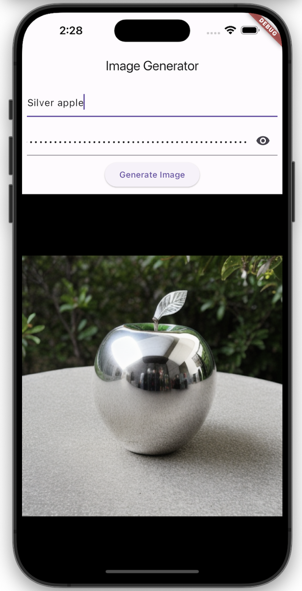

# OpenAI APIs (EdenAI)

The project utilizes EdenAI as an example to demonstrate how to leverage existing AI generation providers and their APIs to meet requirements and retrieve generated content.

## Features

1. Enter your **Prompt** and **EdenAI API Key**.

2. Press **"Generate Image"** to display the AI-generated image below.

   

3. Other examples. 
 
   

# Resources
- [EdenAI](https://www.edenai.co)

